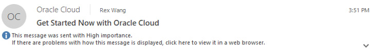

# Data Marketplace Workshop

## Introduction

Welcome to the Data Marketplace workshop. This is the first of several labs that are part of the **Data Marketplace workshop**. This workshop will walk you through the process of setting up a database system, installing and using Application Express (APEX) to use the pre-made Data Marketplace application. Data Marketplace is a pre-built centralized workspace where you can catalog data sets and give quick access through an approval process.

Data Marketplace allows Data Scientists and Analysts to get access to data that they do not own so they can make critical business decisions. As an administrator of this application, you will be able to quickly give external users access to data sets which they can use to gain business insights with tools such as APEX to generate reports or Oracle Analytics Cloud to generate visualizations on the data sets.

**_To log issues_**, click here to go to the [github oracle](https://github.com/oracle/learning-library/issues/new) repository issue submission form.

## Objectives
- Provision a Database system
- Install Application Express (APEX) onto your Database system
- Install Oracle Rest Data Services (ORDS) onto your Database system
- Creation and management of workspaces and users within APEX
- Import Data Marketplace application into APEX workspace

## Required Artifacts
- The following lab requires an Oracle Public Cloud account that will either be supplied by your instructor, or can be obtained through the following steps.

## Step 1: Acquire an Oracle Cloud Trial or Workshop Account
- Bookmark this page for future reference.

- Please click on the URL to create your <a class=“trial-link”  href="https://myservices.us.oraclecloud.com/mycloud/signup?language=en&sourceType=:ex:tb:::RC_NAMK190227P00084:PredictDemandML_ADW_HOL&SC=:ex:tb:::RC_NAMK190227P00084:PredictDemandML_ADW_HOL&pcode=NAMK190227P00084" target="trial">Free Account</a> and complete all the required steps. When you complete the registration process you'll receive a $300 credit that will enable you to complete the lab for free. Additionally, you'll have 1000s of hours left over to continue to explore the Oracle Cloud.

- Soon after requesting your trial you will receive the following email. You may begin working on this lab once you receive this email.

  

## Step 2: Navigate to Lab 100

- Begin working on [Lab 100](LabGuide100.md)

- You can see a list of Lab Guides by clicking on the Menu Icon in the upper left corner of the browser window. You're now ready to continue with Lab 100.

  
