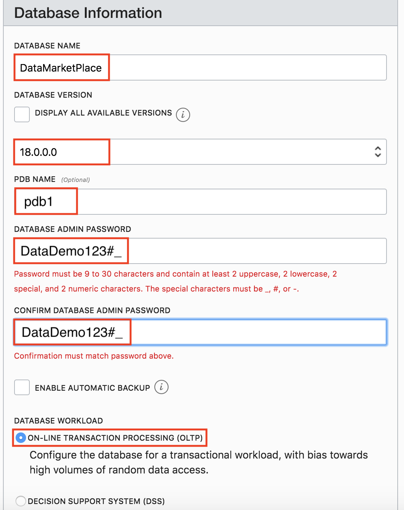

Getting Started with Database Systems
----------------------------------------------------------------------------

  
Updated: May 10, 2019

## **Introduction**

This lab walks you through the steps to get started with provisioning a Database system to run Application Express (APEX). In this lab, you will create a Virtual Cloud Network and related resources needed to provision a Database System on Oracle Cloud Infrastructure.

**_To log issues_**, click here to go to the [github oracle](https://github.com/oracle/learning-library/issues/new) repository issue submission form.

## Objectives
-   Learn how to create a Virtual Cloud Network and related resources
-   Learn how to provision a Database system
-   Learn how to access your Database system Secure Shell (SSH)

## Required Artifacts
-   The following lab requires an Oracle Public Cloud account. You may use your own cloud account, a cloud account that you obtained through a trial, or a training account whose details were given to you by an Oracle instructor.

-   [PuTTY Key Generator](https://www.putty.org/) for Windows operating systems.

# Provision Database system

## Part 1. Generating Secure Shell (SSH) keys

In this section you will create SSH keys to establish secure connections to your database system

### For Windows

### **STEP 1: Download PuTTY Key Generator**

-   Download [PuTTY Key Generator](https://www.putty.org/)

### **Generate SSH Keys using PuTTY Key Generator**

-   Find puttygen.exe in the PuTTY folder on your computer, for example, C:\Program Files (x86)\PuTTY. Double-click puttygen.exe to open it.

-   Accept the default key type, RSA.

-   Set the Number of bits in a generated key to 2048 bits, if it is not already set with that value.

-   Click Generate.

-   Move your mouse around the blank area to generate randomness to the key.

-   The generated key appears under Public key. Save the Public and Private keys as they will be used to provision your database instance.

### For Windows

### **STEP 1: Getting to the Command Line Interface**

-   Open your spotlight search by simultaneously clicking “CMD” and “spacebar”

-   Search for “Terminal” to open your command line interface (CLI)

### **STEP 1: Generate a SSH key-pair**

-   From your CLI input “ssh-keygen”

-   Hit return if you want to use the default file path or specify your own file path

-   Hit return if you do not want to use any pass phrase or input one if you do

  ( Note: A public key (.pub extension), and a private key (no extension), will be generated in your file path. The           default   file path is a hidden file path called .ssh . Show hidden file paths in your Finder by simultaneously clicking     “CMD +       SHIFT + . ” )

## Part 2. Create VCN and related resources

### **STEP 3: Sign in to Oracle Cloud**

-   Go to [cloud.oracle.com](https://cloud.oracle.com), click **Sign In** to sign in with your Oracle Cloud account.

-   Enter your **Cloud Account Name** and click **My Services**.

-   Enter your Oracle Cloud **username** and **password**, and click **Sign In**.

### **STEP 4: Create VCN and related resources**

-   Open dashboard menu, expand services list, and click on Compute.

-   From your compute page, open dashboard menu, expand network tab, and click on Virtual Cloud Networks.

-   Click on Create Virtual Cloud Network.

-   Give your VCN a name, and check the option to create related resources. 
    (Note: You will need this VCN name for provisioning a database instance)
    
    

-   Scroll to the bottom and click Create Virtual Cloud Network

 

## Part 3. Provision Database system

### **STEP 5: Provision your Database instance**

-   Open the dashboard menu, and click on “Bare Metal, VM, and Exadata”.

 

-   Click on Launch DB System

 

-   Fill out the form with a name, and choose your database size/performance capabilities. It is recommended that you choose the same options depicted in the picture below.

 

-   Choose “License Included” and browse for the public key you created in the previous lab.

 

-   Select the VCN that you created, the default subnet for that VCN, and create a hostname prefix for your database

-   Select the latest database version, and choose “On-line Tracsaction Processing for Database WorkLoad

-   Fill out a database name and password

-   Click on Launch DB System

## Great Work - All Done with Lab100!
**You are ready to move on to the next lab. You may now close this tab.**

