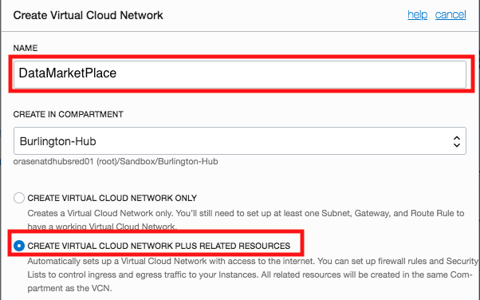

Getting Started with Database Systems
----------------------------------------------------------------------------

  
Updated: June 12, 2019

## **Introduction**

Welcome, company admin. This lab walks you through the steps to get started with provisioning a Database system to run Application Express (APEX). In this lab, you will create a Virtual Cloud Network and related resources needed to provision a Database System on Oracle Cloud Infrastructure. By the end of this lab, you will have a Database instance up and running, ready for to install Application Express.

**_To log issues_**, click here to go to the [github oracle](https://github.com/oracle/learning-library/issues/new) repository issue submission form.

## Objectives
-   Learn how to create a Virtual Cloud Network and related resources
-   Learn how to provision a Database system
-   Learn how to access your Database system Secure Shell (SSH)


## Required Artifacts
-   The following lab requires an Oracle Public Cloud account. You may use your own cloud account, a cloud account that you obtained through a trial, or a training account whose details were given to you by an Oracle instructor.

-   [PuTTY Key Generator](https://www.putty.org/) for Windows operating systems.

# Provision Database system


## Part 1. Generating Secure Shell (SSH) keys

In this section you will create SSH keys to establish secure connections to your database system

### **STEP 1: Download PuTTY Key Generator (For Windows)**

-   Download [PuTTY Key Generator](https://www.putty.org/)

### **STEP 2: Generate SSH Keys using PuTTY Key Generator (For Windows)**

-   Find puttygen.exe in the PuTTY folder on your computer, for example, C:\Program Files (x86)\PuTTY. Double-click puttygen.exe to open it.

-   Accept the default key type, RSA.

-   Set the Number of bits in a generated key to 2048 bits, if it is not already set with that value.

-   Click **Generate**.


-   Move your mouse around the blank area to generate randomness to the key.


-   The generated key appears under Public key. Copy the the public key and save it in any text editor. Save the private key by clicking **Save Private Key**. Keep note of where your Public and Private keys are located as they will be used to provision your database instance. 


-   You may move on to Part 2 Create VCN and related resources.

### **STEP 1: Getting to the Command Line Interface (For Mac/Linux)**

-   Open your spotlight search by simultaneously clicking “CMD” and “spacebar”

-   Search for ```Terminal``` to open your command line interface (CLI)


### **STEP 2: Generate a SSH key-pair (For Mac/Linux)**

-   From your CLI input ```ssh-keygen```. Hit return to use the default file path. Hit return again to skip adding a passphrase. Keep note of the file path location as the SSH keys will be used to provision your database.


  ( Note: A public key (.pub extension), and a private key (no extension), will be generated in your file path. The           default   file path is a hidden file path called .ssh . Show hidden file paths in your Finder by simultaneously clicking     “CMD + SHIFT + . ” )

## Part 2. Create VCN and related resources

### **STEP 1: Sign in to Oracle Cloud**

-   Go to [cloud.oracle.com](https://cloud.oracle.com), click **Sign In** to sign in with your Oracle Cloud account.


-   Enter your **Cloud Account Name** and click **Next**.


-   Enter your Oracle Cloud **username** and **password**, and click **Sign In**.


### **STEP 2: Create VCN and related resources**

-   Open dashboard menu, expand networking tab by hovering over it, and click on **Virtual Cloud Networks**.


-   Click on **Create Virtual Cloud Network**.


-   Name your VCN **DataMarketPlace**, and check the option to create related resources. 
    (Note: You will need this VCN name for provisioning a database instance)
    
    

-   Scroll to the bottom and click **Create Virtual Cloud Network**.

 

-   Click **Close**.

 

## Part 3. Provision Database system

### **STEP 1: Provision your Database instance**

-   Open the dashboard menu, and click on **Bare Metal, VM, and Exadata**.

 

-   Click on **Launch DB System**.

 

-   Fill out the form with following information. Availability Domain will have unique identifiers. Choose the option with US-ASHBURN-AD-1.

```
Display Name:                         DataMP
Availability Domain:                  US-ASHBURN-AD-1
Shape Type:                           Virtual Machine
Shape:                                VM.Standard2.2
Total Node Count:                     1
Oracle Database Software Edition:     Enterprise Edition Extreme Performance
Available Storage Size (GB):          256
```


-   Choose **License Included** and browse for the public key you created in the previous lab.

 

-   Scroll further down the form and select **DataMarketPlace** for the VCN, select the subnet option with ASHBURN AD1, and use **DataMP** for the hostname prefix.


-   Scroll further down the form and select the latest database version, and choose **On-line Trasaction Processing** for Database WorkLoad.

-   Fill out **DataMarketPlace** for database name and **DataDemo123#_** for the password.


-   Click on **Launch DB System**.


## Great Work - All Done with Lab100!
**You are ready to move on to the next lab. You may now close this tab.**


