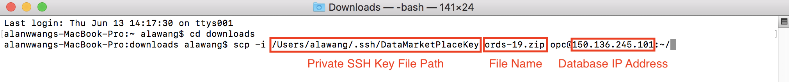
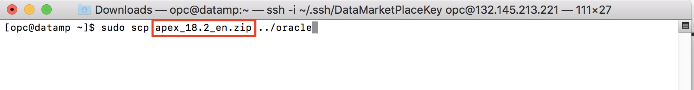
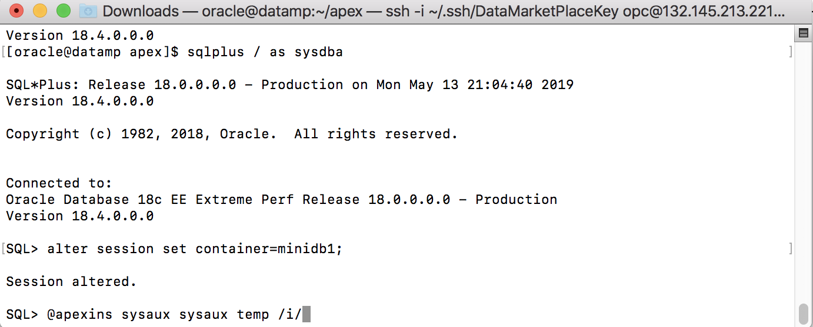
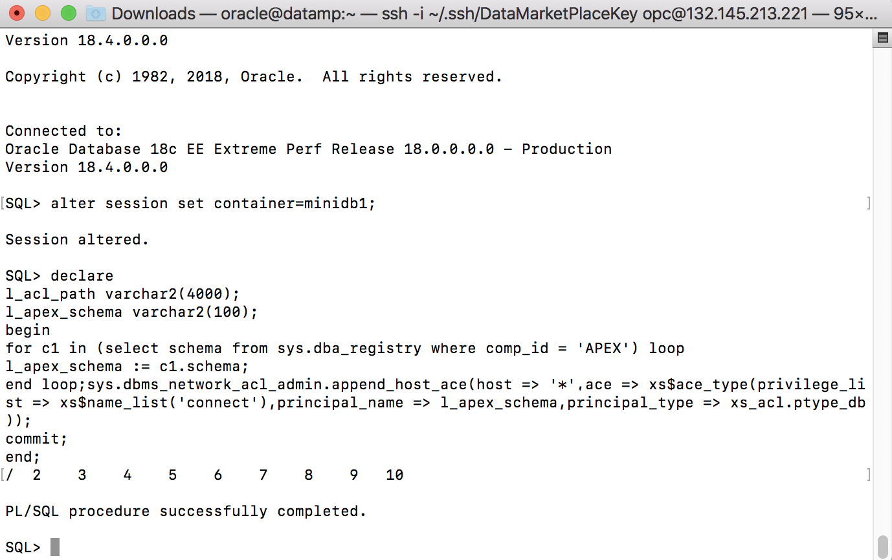

# Application Express (APEX) Installation

  
Updated: May 14, 2019

## Introduction

This lab walks you through the steps to install Application Express (APEX) onto the database instance that you provisioned in the previous lab. APEX is a low-code development platform that enables you to build stunning, scalable, secure apps, with world-class features, that can be deployed anywhere.

**_To log issues_**, click here to go to the [github oracle](https://github.com/oracle/learning-library/issues/new) repository issue submission form.

## Objectives
-   Learn how to use Secure Shell (SSH) to log into your database instance
-   Learn how to configure database instance
-   Learn how to install Application Express

## Required Artifacts
-   The following lab requires an Oracle Public Cloud account. You may use your own cloud account, a cloud account that you obtained through a trial, or a training account whose details were given to you by an Oracle instructor.

-   Oracle Application Apex 18.2 or later (see <a href="https://www.oracle.com/technetwork/developer-tools/apex/downloads/index.html" target="\_blank">Oracle Technology Network download site</a>)

# Application Express Installation

## Part 1. Obtaining APEX files 

### **STEP 1: Download Oracle Application Apex 18.2 or later (see <a href="https://www.oracle.com/technetwork/developer-tools/apex/downloads/index.html" target="\_blank">Oracle Technology Network download site</a>)**

-   Accept the license agreement and download the APEX zip file


-   Compress the APEX file into a zip file if it is not already in zip format


### **STEP 2: Copy or move APEX into your database**

-   Use the following command to copy APEX files into your database instance after navigating to the location of where your APEX files are located (Replace the zip file name and IP address with your own)

	For Windows (Use PuTTY Program)

	```copy apex_18.2_en.zip opc@132.145.213.221:~/```

	For Macs (Use Terminal)

	```scp apex_18.2_en.zip opc@132.145.213.221:~/```
  

  

## Part 2. Using Secure Shell (SSH) to log into your database instance

### **STEP 1: Logging into your database**

-   Locate your database IP address in your cloud tenancy be navigating to your database instance


-   Open your windows Command Prompt or mac Terminal


-   SSH into your database instance with the following syntax, use the file path of where your private SSH key resides and the IP address you found earlier

	```ssh -i File_Path_To_Private_SSH_Key opc@Database_IP_Address```
  


## Part 3. Setting up Oracle environment

### **STEP 1: Oracle database configuration**

-   Change to the oracle user with the following command

	```sudo su – oracle```


-   Find your ORACLE_SID and ORACLE_HOME file path with the command below and take note of it

	```cat /etc/oratab```
  


-   Add ORACLE_SID and ORACLE_HOME to your .bash_profile

	```vi ~/.bash_profile```
  


Vi Editor Commands

```
‘i’       Insert mode

‘:q!’     Quit without saving

‘wq!’     Write and quit
```

-   Add below environment variables at the end of the file and save it. (Replace SID and HOME file path with your own)

	```export ORACLE_SID=APEXDB```
	
	```export ORACLE_HOME=/u01/app/oracle/product/12.1.0.2/dbhome_1```
	
	```export PATH=$ORACLE_HOME/bin:$PATH```
  


-   Run source command

	```source ~/.bash_profile```
  


## Part 4. APEX Installation


### **STEP 1: Installing APEX onto the database**

-   Navigate back to the opc user with the command “exit”


-   Use the following command to copy APEX files from your opc user over to the oracle user (Replace the zip file name with your own)
	
	For Windows

	```sudo copy apex_18.2_en.zip ../oracle```

	For Macs

	```sudo scp apex_18.2_en.zip ../oracle```
  



### **STEP 2: Changing to the Oracle user**

-   Change user with the following command

	```sudo su – oracle```
  


### **STEP 3: Unzip your APEX files**

-   Use the following command to unzip your APEX files (Replace file name with your own)

	```unzip apex.zip```
  


### **STEP 4: APEX Configuration**

-   Change to the apex directory with the following command

	```cd apex```
  


-   Start SQL*Plus and ensure you are connecting to your PDB and not to the “root” of the container database. Run the Commands below to login.

	```sqlplus / as sysdba```
	
	```alter session set container=pdb1;```
	
	```@apexins sysaux sysaux temp /i/```
  


  (Note: If pdb1 doesn’t exist, then you may create one with this command. Change the
	username and password of the user to anything you wish.)
	
	CREATE PLUGGABLE DATABASE pdb1 ADMIN USER pdb_adm IDENTIFIED BY Password1;
  


-   Wait until you see sql prompt.

-   Unlock the APEX_PUBLIC_USER account and set the password.

	```alter user apex_public_user identified by BEstrO0ng_#11 account unlock;```
  


-   Create the APEX Instance Administration user and set the password.
	
	```begin
	
	apex_util.set_security_group_id( 10 );
	
	apex_util.create_user(p_user_name => ‘ADMIN’,p_email_address =>
	
	‘Enter your Email id’,p_web_password => ‘BEstrO0ng_#11’,p_developer_privs => ’ADMIN’ );
	
	apex_util.set_security_group_id( null );
	
	commit;
	
	end;
	
	/
	```


-   Run APEX REST configuration, and set the passwords of APEX_REST_PUBLIC_USER and APEX_LISTENER.

	```@apex_rest_config_core.sql ./ BEstrO0ng_#11 BEstrO0ng_#11```
  


-   Create a network ACE for APEX (This is used when consuming Web services or sending outbound mail. Replace the * with your own IP).

	```l_acl_path varchar2(4000);*
	
	l_apex_schema varchar2(100);*
	
	begin*
	
	for c1 in (select schema from sys.dba_registry where comp_id = ‘APEX’) loop*
	
	l_apex_schema := c1.schema;*
	
	end loop;*
	
 	sys.dbms_network_acl_admin.append_host_ace(host => ‘*‘,ace => xs$ace_type(privilege_list => xs$name_list(‘connect’),principal_name => l_apex_schema,principal_type => xs_acl.ptype_db));*
	 
	commit;
	
	*end;*
	
	*/*
	```
  

  
-   Exit SQL*Plus with ```exit``` command


