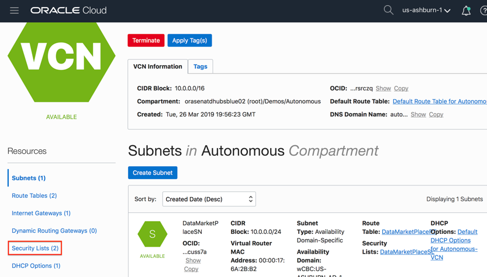
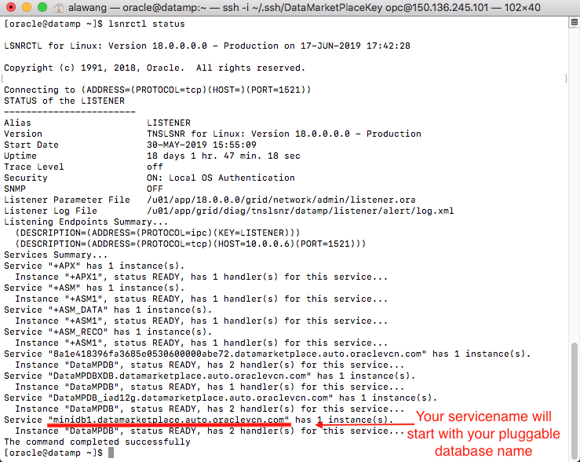

# Oracle Rest Data Services (ORDS) Installation

  
Updated: May 15, 2019

## Introduction

This lab walks you through the steps to install Oracle Rest Data Services (ORDS) onto the database instance that you provisioned in the previous lab. ORDS is a mid-tier Java application that makes it easy to develop modern REST interfaces for relational data in the Oracle Database and returns any results formatted using JSON.

**_To log issues_**, click here to go to the [github oracle](https://github.com/oracle/learning-library/issues/new) repository issue submission form.

## Objectives
-   Learn how to install and configure Oracle Rest Data Services

## Required Artifacts
-   The following lab requires an Oracle Public Cloud account. You may use your own cloud account, a cloud account that you obtained through a trial, or a training account whose details were given to you by an Oracle instructor.

# Oracle Rest Data Services Installation

### **STEP 1: Download Oracle Rest Data Services 18.2 or later (see [Oracle Technology Network download site(https://www.oracle.com/technetwork/developer-tools/rest-data-services/downloads/index.html)**

-   Accept the license agreement and download the ORDS file


-   Compress the ORDS file into a zip file if it is not already in zip format


### **STEP 2: Copy ORDS file into database instance**

-   Locate your database IP address in your cloud tenancy be navigating to your database instance


-   Use the following command to copy ORDS files into your database instance after navigating to the location of where your ORDS files are located (Replace the zip file name and IP address with your own)
	
	For Windows (Use PuTTY Program)

	```copy ords-19.zip opc@132.145.213.221:~/```

	For Macs (Use Terminal)

	```scp ords-19.zip opc@132.145.213.221:~/```
  
  


### **STEP 3: Logging into database and changing users**

-   SSH into your database instance with the following syntax, use the file path of where your private SSH key resides and the IP address you found earlier

  	```ssh -i <File_Path_To_Private_SSH_Key> opc@<Database_IP_Address>```
  


-   Change to the Oracle user with the following command

 	 ```sudo su – oracle```
  


### **STEP 4: Opening ORDS Files**

-   Create a directory called “ords” with the following command 

 	 ```mkdir ords```
  
  

-   Move back to opc user 

  	```exit```
  
 

-   Copy ORDS file over to Oracle user into the ords directory

	```sudo scp ords-19.zip ../oracle/ords```
  
 

-   Move back to Oracle user 

	```sudo su - oracle```
  


-   Change to ords directory with the following command 

	```cd ords```
  

  
-   Unzip ORDS file 

	```unzip ords-19.zip```
  
 

### **STEP 5: ORDS Configuration Part 1**

-   Use the “exit” command to move back to opc user. Then use “sudo su” command to move to root user.
  
 

-   Check access rule in iptables and open port for 80 and 8080 with the following commands.

	```iptables -I INPUT 8 -p tcp -m state --state NEW -m tcp --dport 8080 -j ACCEPT -m comment --comment "Required for APEX."
	service iptables save
	iptables -t nat -I PREROUTING -p tcp --dport 80 -j REDIRECT --to-port 8080
	service iptables save
  
 
    
### **STEP 6: Add ingress rule for your VCN to allow from public internet to 8080 and 1521**

-   Go to [cloud.oracle.com](https://cloud.oracle.com), click **Sign In** to sign in with your Oracle Cloud account.

 

-   Enter your **Cloud Account Name** and click **My Services**.

 

-   Enter your Oracle Cloud **username** and **password**, and click **Sign In**.

 

-   From your homepage, open the side menu, expand Networking tab, and click on Virtual Cloud Networks.

 


-   Click on the VCN named **DataMarketPlace**

 

-   Scroll the page down to see more of the resources menu on the left side. Click on **Security Lists**.

 

-   Click on the Security List named **DataMarketPlace**

 

-   Click on **Ingress Rules**. Then click on **Edit All Rules**.

 

-   Click on **+ Another Ingress Rule** two times to add two more rules. 

 

-   Fill in **0.0.0.0/0** for source CIDR on Ingress rule 2 and 3. Fill in **8080** for one of the Destination Port Range and **1521** for the other one.

 

-   Scroll to the bottom of the page and click on **Save Security List Rules**.

 

### **STEP 7: ORDS Configuration Part 2**

-   Open your windows PuTTY Program or mac Terminal

-   SSH into your database instance with the following syntax, use the file path of where your private SSH key resides and the IP address you found earlier

	```ssh -i File_Path_To_Private_SSH_Key opc@Database_IP_Address```

 

-   Change to Oracle user with the following command

	```sudo su – oracle```
  
 

-   Change to ords directory with the following command 

	```cd ords```
  


-   Check your database hostname. Note it down as you will need it 

	```hostname```
  
  

-   Check your database servicename. Note it down as you will need it 

	```lsnrctl status```
  


-   Change to params directory with the following command

	```cd params```
  


-   Edit ords_params.properties file


	```vi ords_params.properties```
  


-   Press “I” to enter insert mode


-   Delete all the content and replace with the text below. Use your own hostname and servicename.

```db.hostname=apex (Change Hostname for your Database Instance)
db.port=1521
db.servicename=pdb1.demosubnet1.vcn1.oraclevcn.com (Change servicename for your Database Instance)
db.username=APEX_PUBLIC_USER
db.password=BEstrO0ng_#11
migrate.apex.rest=false
plsql.gateway.add=true
rest.services.apex.add=true
rest.services.ords.add=true
schema.tablespace.default=SYSAUX
schema.tablespace.temp=TEMP
standalone.mode=TRUE
standalone.http.port=8080
standalone.use.https=false
standalone.static.images=/home/oracle/apex/images
user.apex.listener.password=BEstrO0ng_#11
user.apex.restpublic.password=BEstrO0ng_#11
user.public.password=BEstrO0ng_#11
user.tablespace.default=SYSAUX
user.tablespace.temp=TEMP
```


-   Press the **esc** key to exit insert mode

-   Type **wq!** and press your return key to save the file


