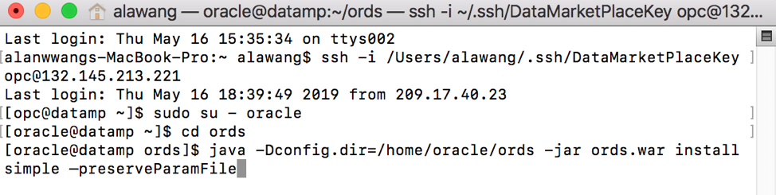
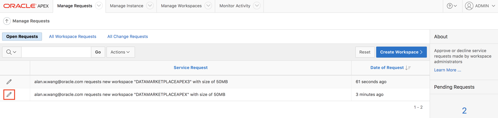
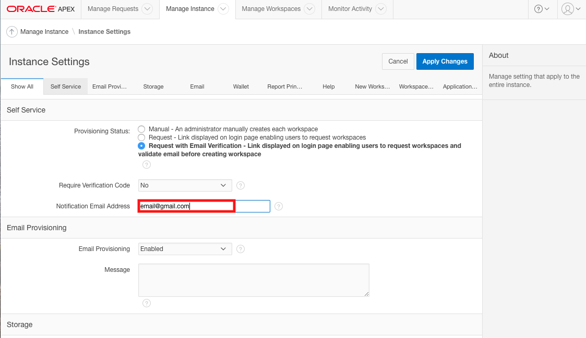
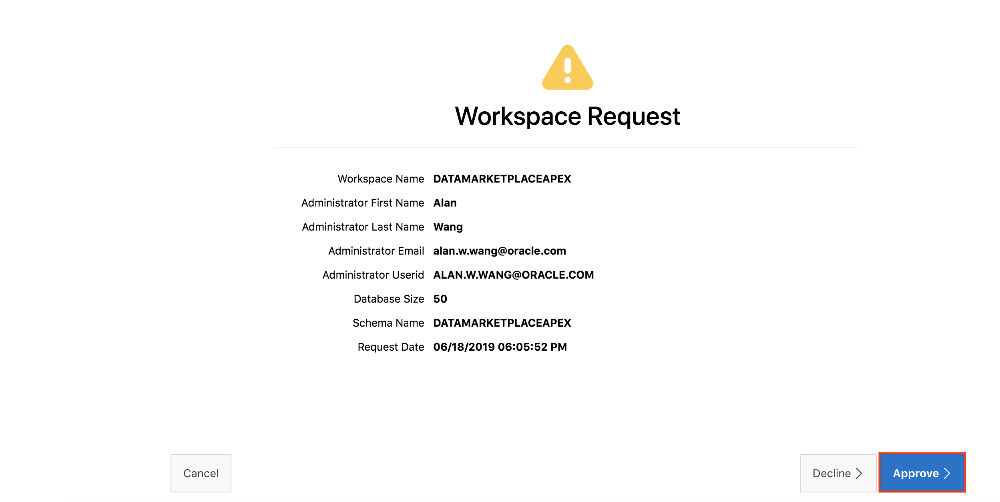
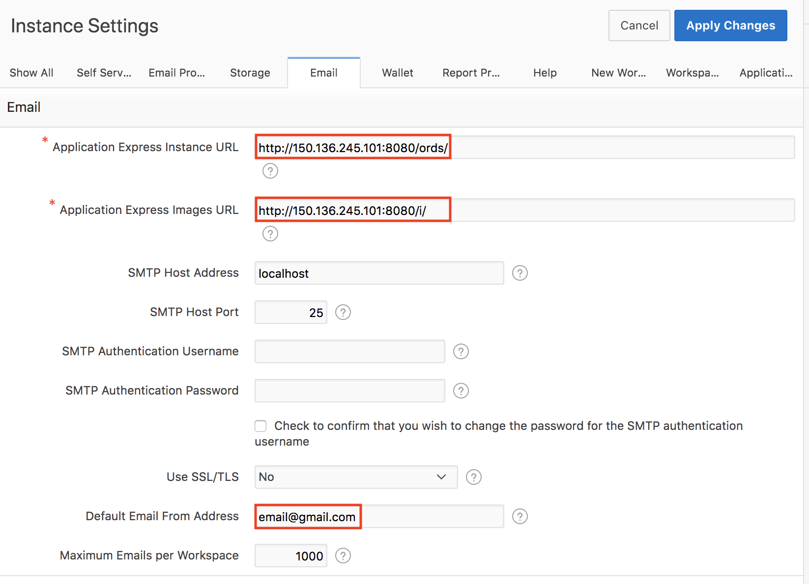
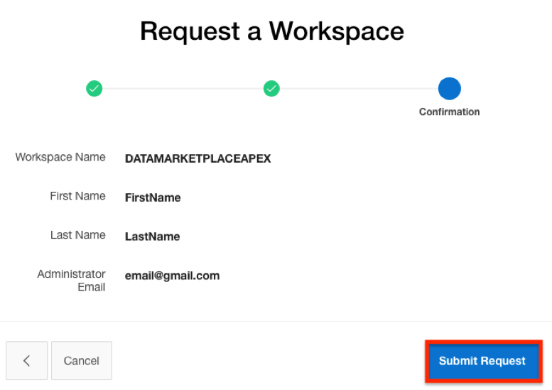

# Application Express (APEX)

  
Updated: June 4, 2019

## Introduction

This lab walks you through the steps to use and manage Application Express (APEX). APEX is a low-code development platform that enables you to build stunning, scalable, secure apps, with world-class features, that can be deployed anywhere.

**_To log issues_**, click here to go to the [github oracle](https://github.com/oracle/learning-library/issues/new) repository issue submission form.

## Objectives
-   Learn how to use Application Express

## Required Artifacts
-   The following lab requires an Oracle Public Cloud account. You may use your own cloud account, a cloud account that you obtained through a trial, or a training account whose details were given to you by an Oracle instructor.

# Oracle Rest Data Services Installation

### **STEP 1: Start Oracle Rest Data Services**

-   Open windows PuTTY program or mac Terminal.

-   SSH into your database instance with the following syntax, use the file path of where your private SSH key resides and the database IP address.

	```ssh -i <File Path To Private SSH Key> opc@<Your Database IP Address>```


-   Change to root user with the following command.

	```sudo su ```


-   Start mailing service.
    
    	Service postfix start


-   Change to Oracle user with the following command.

  	```sudo su – oracle```
  


-   Change to ords directory with the following command. 

  	```cd ords```
	


-   Start ORDS with the following command.

 	 ```java -Dconfig.dir=/home/oracle/ords -jar ords.war install simple –preserveParamFile```
 
  

(Note: The first time you start ORDS, you will be prompted for database username and password. Use “sys” for the username and your database password.)

### **STEP 2: APEX configuration**

-   Navigate to APEX with the following url (Replace brackets and its content with your own IP address ).

  	```http://<Your IP Address>:8080/ords```
  
 

-   Log into internal APEX workspace with these credentials. 

```
Admin Workspace:	INTERNAL
User:			ADMIN
Pass:			BEstrO0ng_#33
```

 
  
-   Expand your Manage Instance tab and click on **Instance Settings**.
  
 


-   Change Provisioning settings to last option.

 

-   Fill in the **Notification Email Address** with the email address you used to create your workspace.

 

-   Click on the Email tab.
  
 

-   Replace the IP addresses in the three red boxed fields with your own IP address.

 

-   Click **Apply Changes**.


### **STEP 3: APEX workspaces**

-   Navigate to APEX with the following url (Replace brackets and its content with your own IP address ).

  	```http://<Your IP Address>:8080/ords```
  
 

-   Click on **request a workspace**.
  
 

-   Fill out your name and email. Name your workspace **DATAMARKETPLACEAPEX** and click **next**.

 

-   Click on **Submit Request**.
  


-   An email will be sent to the email you used. Navigate to the email and click **Create Workspace**.


-   Set your password for the workspace.


## Great Work - All Done with Lab400!
**You are ready to move on to the next lab. You may now close this tab.**
