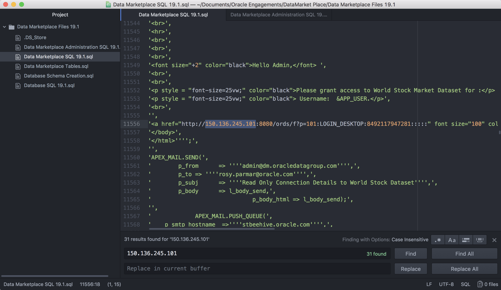

# Getting Started with Data Marketplace

  
Updated: May 22, 2019

## Introduction

This lab walks you through the steps to set up and configure Data Marketplace. Data Marketplace is a pre-built centralized workspace where you can catalog data sets and give quick access through an approval process. 


**_To log issues_**, click here to go to the [github oracle](https://github.com/oracle/learning-library/issues/new) repository issue submission form.

## Objectives
-   Learn how to import APEX applications
-   Learn load data sets through SQL Developer
-   Learn how to set up Data Marketplace

## Required Artifacts
-   The following lab requires an Oracle Public Cloud account. You may use your own cloud account, a cloud account that you obtained through a trial, or a training account whose details were given to you by an Oracle instructor.

-   Oracle SQL Developer 18.3 or later (see <a href="http://www.oracle.com/technetwork/developer-tools/sql-developer/downloads/index.html" target="\_blank">Oracle Technology Network download site</a>)

-   Data Marketplace SQL File

-   Data Marketplace Administration SQL File

-   Database SQL File

-   Database Schema Creation File

-   Data Marketplace Tables File

-   Data Marketplace Data Set File

## Part 1. Importing Data Marketplace application

### **STEP 1: Download the required files and prepare data files**

-   Download these two files.

```
Data Marketplace SQL File
Data Marketplace Administration SQL File
```
-   Open Data Marketplace SQL File in any text editor.

-   Search and replace the following IP address with your own IP address and save it.

    132.145.213.221 (Note: Use Ctrl + F or CMD + F to bring up the search option in your editor)
    


### **STEP 2: Logging into APEX workspace**

-   Open windows PuTTY program or mac Terminal.

-   SSH into your database instance with the following syntax, use the file path of where your private SSH key resides and your IP address.

    ```ssh -i File_Path_To_Private_SSH_Key opc@Database_IP_Address```
    


-   Change to Oracle user with the following command.

    ```sudo su – oracle```
   


-   Change to ords directory with the following command.

    ```cd ords```
    
 

-   Start ORDS with the following command.

    ```java -Dconfig.dir=/home/oracle/ords -jar ords.war install simple –preserveParamFile```
    
  

-   Go to APEX url (Replace the IP address with your own)

    http://132.145.213.221:8080/ords
    
 

-   Sign into the APEX workspace that you created in lab 400.


