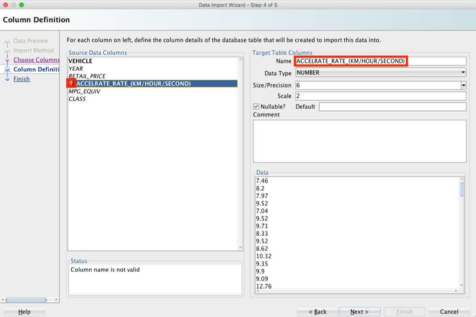

# Getting Started with Data Marketplace

  
Updated: May 22, 2019

## Introduction

This lab walks you through the steps to set up and configure Data Marketplace. Data Marketplace is a pre-built centralized workspace where you can catalog data sets and give quick access through an approval process. 


**_To log issues_**, click here to go to the [github oracle](https://github.com/oracle/learning-library/issues/new) repository issue submission form.

## Objectives
-   Learn how to import APEX applications
-   Learn load data sets through SQL Developer
-   Learn how to set up Data Marketplace

## Required Artifacts
-   The following lab requires an Oracle Public Cloud account. You may use your own cloud account, a cloud account that you obtained through a trial, or a training account whose details were given to you by an Oracle instructor.

-   Oracle SQL Developer 18.3 or later (see <a href="http://www.oracle.com/technetwork/developer-tools/sql-developer/downloads/index.html" target="\_blank">Oracle Technology Network download site</a>)

-   Data Marketplace SQL File

-   Data Marketplace Administration SQL File

-   Database SQL File

-   Database Schema Creation File

-   Data Marketplace Tables File

-   Data Marketplace Data Set File

## Part 1. Importing Data Marketplace application

### **STEP 1: Download the required files and prepare data files**

-   Download these two files.

```
Data Marketplace SQL File
Data Marketplace Administration SQL File
```
-   Open Data Marketplace SQL File in any text editor.

-   Search and replace the following IP address with your own IP address and save it.

    132.145.213.221 (Note: Use Ctrl + F or CMD + F to bring up the search option in your editor)
    


### **STEP 2: Logging into APEX workspace**

-   Open windows PuTTY program or mac Terminal.

-   SSH into your database instance with the following syntax, use the file path of where your private SSH key resides and your IP address.

    ```ssh -i File_Path_To_Private_SSH_Key opc@Database_IP_Address```
    


-   Change to Oracle user with the following command.

    ```sudo su – oracle```
   


-   Change to ords directory with the following command.

    ```cd ords```
    
 

-   Start ORDS with the following command.

    ```java -Dconfig.dir=/home/oracle/ords -jar ords.war install simple –preserveParamFile```
    
  

-   Go to APEX url (Replace the IP address with your own)

    http://132.145.213.221:8080/ords
    
 

-   Sign into the APEX workspace that you created in lab 400.


### **STEP 3: Importing APEX applications**

-   Click on **Import**.


-   Find your Data Marketplace SQL File and click **Next**.


-   Click **Next** to confirm your import.


-   Install the application with ID 100 by clicking **Reuse Application ID 100** and then click **Install Application**.


-   Click on **Import**.


-   Find your Data Marketplace Administration SQL File and click **Next**.


-   Click **Next** to confirm your import.


-   Install the application with ID 101 by clicking **Reuse Application ID 101** and then click **Install Application**.


### **STEP 4: Allow user access to imported applications**

-   Click on **Data Marketplace application** (ID 100)


-   Click on **Shared Components**.


-   Click on **Application Access Control**.


-   Click on **Add User Role Assignment**.


-   Add your APEX workspace user (The email you used to create the workspace), check all three roles and click on **Create Assignment**.


-   Click on **App Builder** to navigate back to the main page.


-   Click on **Data Marketplace Administration application** (ID 101)


-   Click on **Shared Components**.


-   Click on Application **Access Control**.


-   Click on **Add User Role Assignment**.


-   Add your APEX workspace user (The email you used to create the workspace), check all three roles and click on **Create Assignment**.


## Part 2. Load data sets through SQL Developer

### **STEP 1: Download [SQL Developer](https://www.oracle.com/technetwork/developer-tools/sql-developer/downloads/index.html)**

-   Accept the license agreement and click **Download**.


### **STEP 2: Connecting to your database with SQL Developer**

-   Click on the **Green Plus Icon** to start a new connection.


-   Create database connection with the following. Click **Connect** when done.

```
Connection Name:		DataMarketPlace
Username:			sys
Password:			Use your own Database Password
Role:				SYSDBA
Hostname:			Your Database IP Address
Service Name:			Your database service name can be found by using SSH to log into your database and running the command lsnrctl status
```


### **STEP 3: Load data sets into database**

-   Download Database Schema Creation File, Data Marketplace Tables File, and Data Marketplace Data Set File. Unzip the Data Marketplace Data Set File for all the excel data files.

-   Copy the SQL statements from Database Schema Creation File and paste them into SQL Developer worksheet. Run the SQL statements to create a schema for each data set in your pluggable database (pdb1)


-   Expand the options for your database, scroll down to Other Users and expand the tab to find all the schemas.


-   Find the schema called **WORLD_STOCK_MARKET_AND_INDUSTRY_PROD** and expand the options.


-   Right click **Tables (Filtered)** and click **Import Data**.


-   Click on **Browse** and open the WORLD_STOCK_MARKET_AND_INDUSTRY_PROD excel file.


-   Click on **Next**.


-   From Data Marketplace Tables File find all the table names, use WORLD_STOCK_MARKET_AND_INDUSTRY_PROD_DATA for the Table Name. Click **Next**.


-   Click on **Next**.


-   Columns with an invalid name will appear with red bubbled exclamation mark. Change Name to something different that doesn’t violate rules such as keywords like date or symbols like **/**, **-**, or **( )**. In this example we will change DATE to DAY and WEIGHTED_STOCK_MKT_INDEX_(XGDP) to WEIGHTED_STOCK_MKT_INDEX_XGDP.


-   Click on **Next**.


-   Click on **Finish**.

-   Locate the next schema WORLD_MTCO2_EMISSION_AND_POPULATION and expand the options.


-   Import data and use WORLD_MTCO2_EMISSION_AND_POPULATION_DATA for the table name.


-   There are no invalid column names in this table. Click **Next** and proceed to click **Finish** to import the table.


-   Locate the next schema WORLD_HYBRID_CARS_FUEL and expand the options.


-   Import data and use WORLD_HYBRID_CARS_FUEL_DATA for the table name.


-   There is one invalid column name in this table. Delete the **( )** and replace the **/** with underscores ( _ ) for better readability. 

        ACCELRATE_RATE_KM_HOUR_SECOND
        


-   Click **Next** and proceed to click **Finish** to import the table.



(Note: There are a total of 16 data sets. You may continue uploading the rest of the tables or proceed with less data in Data Marketplace. Follow the table names in the Data Marketplace Tables File for the optional data sets.)

## Part 3. Setting up Data Marketplace application

### **STEP 1: Configurations for Data Marketplace**

-   Download Database SQL File.

-   Start SQL Developer and open your DataMarketPlace connection by double clicking the connection name.


-   Fill in **sys** for the username and your database password to log in.


-   Clear your SQL worksheet if there are any SQL statements in it.


-   Download Database SQL File and copy and paste the SQL statements into your worksheet. Run the Statements by clicking the **Run Script** button.


## Part 4. Starting Data Marketplace application

### **STEP 1: Start Oracle Rest Data Services**

-   Open windows PuTTY program or mac Terminal.

-   SSH into your database instance with the following syntax, use the file path of where your private SSH key resides and your database IP address.

	```ssh -i File_Path_To_Private_SSH_Key opc@Database_IP_Address```
    
 

-   Change to Oracle user with the following command.

	```sudo su – oracle```
    
-   Change to ords directory with the following command. 

	```cd ords```
    
 

-   Start ORDS with the following command.

	```java -Dconfig.dir=/home/oracle/ords -jar ords.war install simple –preserveParamFile```
    
 

### **STEP 2: Start Data Marketplace application**

-   Go to the APEX url (Replace the IP address with your own)

    http://132.145.213.221:8080/ords
    


-   Sign into the APEX workspace that you created in lab 400.


-   Click on the **Data Marketplace application** (ID 100)


-   Click on **Run Application**.


-   Use the email and password you used to create your workspace to log into Data Marketplace.


-   Installation complete. You can now start exploring Data Marketplace.


