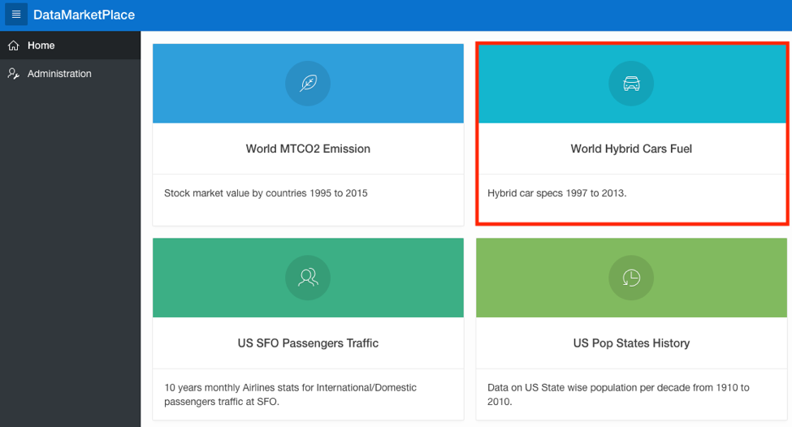

# Data Marketplace Application

  

Updated: June 11, 2019

## Introduction

This lab walks the data scientists and Admins through the steps in utilizing Data Marketplace. Data Marketplace is a pre-built centralized workspace where you can catalog data sets and give quick access to data scientists through an approval process as an admin. 

**_To log issues_**, click here to go to the [github oracle](https://github.com/oracle/learning-library/issues/new) repository issue submission form.

## Objectives
-   Learn how to register for a Data Marketplace workspace
-   Learn how to approve a Data Marketplace workspace request
-   Learn how to request data sets
-   Learn how to approve data set requests
-   Learn how to access requested data sets through Oracle Analytics Cloud

## Required Artifacts
-   The following lab requires an Oracle Public Cloud account. You may use your own cloud account, a cloud account that you obtained through a trial, or a training account whose details were given to you by an Oracle instructor.

## Part 1. Exploring Data Marketplace and Admin Approval app

### **STEP 1: Register for a Data Marketplace workspace**

-   New users can get a new account by clicking on Register.

-   Fill in your information and name your workspace **USERMARKETPLACE**. Click on **Next**.

-   Click on **Submit Request**.

-   As an admin, you will need to approve of the new user request. From your APEX workspace, navigate to the Admin Approval app and run it.

-   Sign into Admin Approval with your Admin workspace credentials.

-   Click on **Workspace Requests**.

-   Double click on the status row for the request from USERMARKETPLACE. Click the drop-down menu and change the status to Approved. Click on the Approve button to allow the request.

-   The new user will receive two emails from the approved request. One email with the credentials to all his workspaces and one email to create their workspace. Open the email that allows you to create your workspace and click on **Create Workspace**.

-   Navigate to the email with your workspace credentials. There is an APEX link as well as a Data Marketplace link for the new user to access. Open the Data Marketplace link and sign on with the new user credentials. The first time you sign on, you will be asked for a password change. Fill in the page and click **Apply Changes**.

-   You can view data sets by clicking on any of them.

-   The new user can subscribe to any data that they want access to by clicking **Subscribe**.

-   As the Admin, you have the ability to approve access to any data set requests from your Admin Approval app. Click on **Schema Request**.

-   Approve requested data sets the same way you approve workspaces. There will be a Grant button instead of an Approve button.

## Part 2. Accessing data sets through Oracle Analytics Cloud (OAC)

### **STEP 1: Provision Oracle Analytics Cloud instance

-   From your cloud tenancy homepage navigate to the service dashboard.

-   From your service dashboard navigate to the Analytics page.

-   Click on Create Instance.

-   Fill in DataMarketplaceOAC for Instance Name and click **Next**.

-   Click **Create**.

### **STEP 2: Creating Oracle Analytics Cloud connections

-   Expand the menu and click on Oracle Analytics Cloud URL.

-   Click on **Create**.

-   Click on **Connection**.

-   Click on **Oracle Database**.

-   Fill in the required information. If you named your pluggable database with a different name, be sure to use the right servicename. The servicename can be found in your database instance as the oracle user with the command lsnrctl status. Click **Save**.

    Connection Name:			DataMarketPlace
    Host:					<Your Database IP Address>
    Port:					1521
    Username:				USERMARKETPLACE
    Password:				<Password for the user>
    Servicename:				pdb1.datamarketplace.auto.oraclevcn.com 
  

### **STEP 3: Creating Data sets from database data

-   Click on **Create**. Then click on **Data Set**.

-   Click on your database connection, **DataMarketPlace**.

-   Now you have access to any data sets you subscribed to. From here you can add any data set you want and create data visualizations from the data in Oracle Analytics Cloud.

## Congratulations. You have completed learning how to install and use Data Marketplace!
